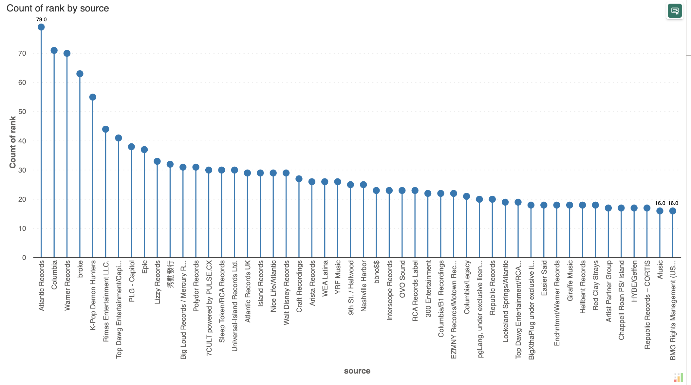
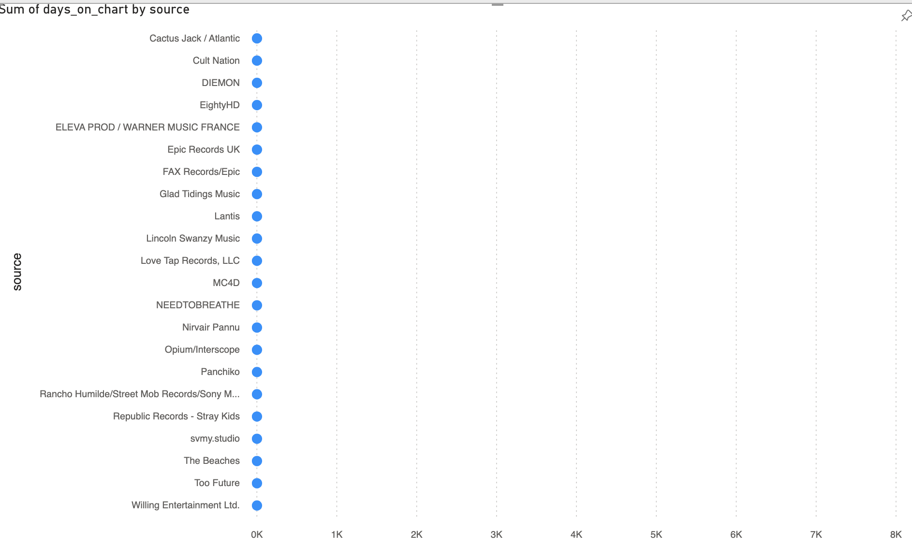
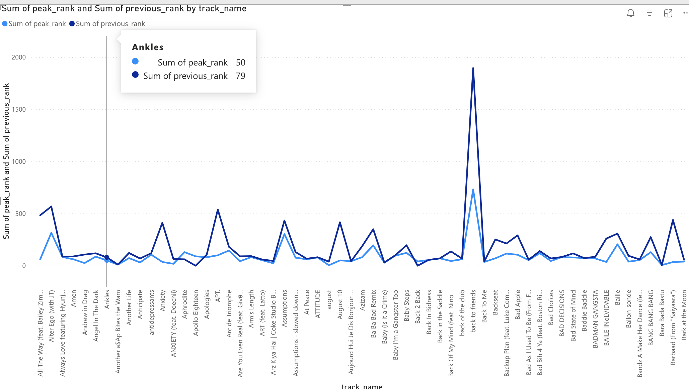
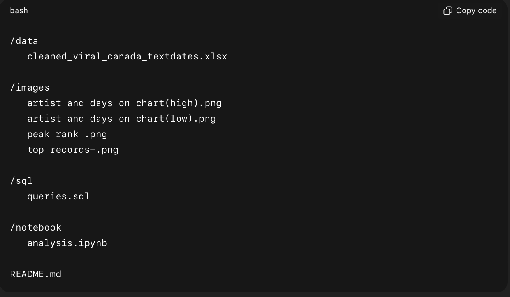
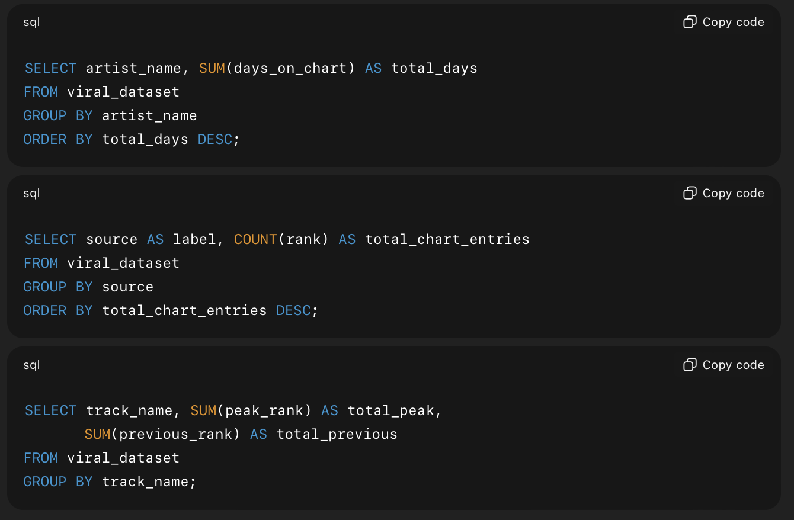
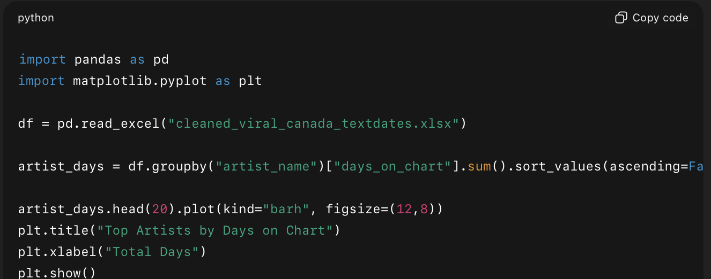

# Sportify-Canada-Viral-Song-2025
Analysis of Spotify Viral  (Canada) chart data from Jan–Nov 14th 2025 using Python, SQL, and Power BI. Features artist longevity, label dominancand  peak rank momentum.

### Project Summary
This project analyzes Spotify Viral Chart data in Canada from January to November 14th, 2025, focusing on:
Artist longevity (days on chart)
Record label impact
Peak rank momentum
Data cleaning & automation
Visualization storytelling
It demonstrates strong analytical skills using Python, SQL, and Power BI, and highlights your ability to:
✔ Clean messy real-world datasets
✔ Perform detailed exploratory data analysis
✔ Create meaningful insights from charts
✔ Work with multi-source, multi-file data
✔ Build a professional portfolio-ready project

### Data Collection & Cleaning
Data Sources
Spotify Viral Songs (Canada) – Daily Chart Files (multiple Excel sheets)
External genre verification using online music metadata
Cleaning Steps (Power Query + Python):
Standardized inconsistent date formats
Removed duplicates
Standardized column names
Converted all numeric values
Merged 10+ files into one consolidated dataset
Extracted features:
days_on_chart
peak_rank
previous_rank
source (label)
After cleaning, a final dataset of ~2,500+ rows was produced.

### Techniques Used
SQL
Filtering and ranking
Grouping and aggregations
Extracting artist dominance
Label ranking and score metrics
Python
Data cleaning with Pandas
Grouping & aggregations
Genre inference
Visualizations using Matplotlib
Feature engineering
Power BI
Advanced bar charts
Line charts for rank momentum
Comparative visuals
Label performance dashboards

### Key Insights & Visualizations
⭐ A. Viral Longevity: Days on Chart by Artist
Interpretation
This visualization illustrates the total number of days each artist appeared on the Canadian Viral Chart. This metric measures true longevity, highlighting artists who sustain cultural impact vs those who peak briefly.
Top performers such as The Red Clay Strays, sombr, and Riley Green maintained long-term visibility with 5500–8000+ total days counted across tracks.
This indicates:
strong playlist rotation
loyal fan engagement
repeated viral cycles
consistent re-entry
Mid-tier artists like Zach Top, Leon Thomas, Ravyn Lenae show stable engagement but shorter cycles.
Lower-tier artists show short-lived spikes — often viral hits with fast declines.

⭐ B. **Record Label Chart Presence (Count of Rank)**

This visualization shows which record labels appear most frequently on the viral charts.
A higher "Count of Rank" means the label:
releases more viral music
has multiple successful artists
shows recurring presence across weeks
Labels like Atlantic Records, Columbia, and Warner Records dominate, demonstrating:
broad artist rosters
consistent market influence
strong viral marketing and distribution teams
Mid-tier labels show competitive influence, while the long tail shows niche or emerging labels with isolated viral successes.
Lowest-tier labels often have:
- one-time or rare viral spikes  
- limited marketing budgets  
- smaller audiences  
- songs that trend briefly on social platforms but do not sustain momentum  
Their presence shows that any label can achieve a viral moment, but maintaining consistent chart impact requires the reach, infrastructure, and strategic backing that top-tier labels possess.

⭐ **C.Peak Rank vs Previous Rank (Momentum Analysis)**

The line chart compares each track’s Peak Rank (light blue) with its Previous Rank (dark blue), allowing us to evaluate how songs are moving through the Canadian viral charts over time.
•	Peak Rank represents the best position a song has ever achieved.
•	Previous Rank represents the song’s most recent position before the current chart update.
By comparing the two, we can determine whether a track is gaining momentum, staying stable, or declining.

What This Chart Shows
1.	Momentum Tracking
When the dark-blue previous-rank line moves closer to the light-blue peak line, the track is rising in popularity.
When it moves further away, the song is losing momentum.
2.	Performance Stability
Tracks where the two lines stay close together show steady audience engagement — meaning consistent streaming, playlist rotation, or viral activity.
3.	Sharp Movements (Spikes)
The large spikes in the dark-blue line represent sudden drops or temporary low positions.
These may reflect:
-viral hype fading fast
-a strong competitor entering the chart
- algorithmic playlist changes
- weekend/weekday streaming shifts
4.	Outliers Worth Investigating
Songs with extreme jumps (like the tall blue spike in the middle of the chart) are outliers.
These unusual patterns often happen when:
o	a song previously trended heavily, then plummeted
o	a trend resurfaced unexpectedly
o	the track was boosted by TikTok or short-form content
o	playlist algorithms shifted

Project Folder Structure

SQL queries below were created to analyze key performance patterns in the Spotify Viral Canada dataset. They demonstrate grouping, aggregation, ranking, and multi-metric evaluation.

Python workflow was designed to handle cleaning, grouping, and basic exploratory analysis before visualization in Power BI.
It ensures the dataset is fully prepared before BI modeling.

Final Conclusion
This project represents more than a technical exercise for me,  it reflects my growth and determination as a data analyst. Collecting daily Spotify Viral Chart data in Canada from January to November 2025, cleaning multiple inconsistent files, merging them into a unified dataset, and extracting meaningful insights required patience, discipline, and genuine curiosity. These are qualities I’ve built over time through my background in fraud detection, technology management, and real-world analytical problem-solving.
Working through SQL, Python, Power BI, and structured documentation on GitHub allowed me to demonstrate the full cycle of data analytics:
✔ Acquiring raw, messy real-world data
✔ Cleaning and transforming it into a reliable dataset
✔ Exploring trends and building new features
✔ Validating patterns with Python
✔ Querying deeply with SQL
✔ Creating visual stories in Power BI
✔ Presenting everything clearly in a structured project
This experience strengthened my ability to think critically, handle complexity, and communicate insights with clarity — skills I use daily as a fraud agent and which I am continuously building as I transition deeper into analytics.
